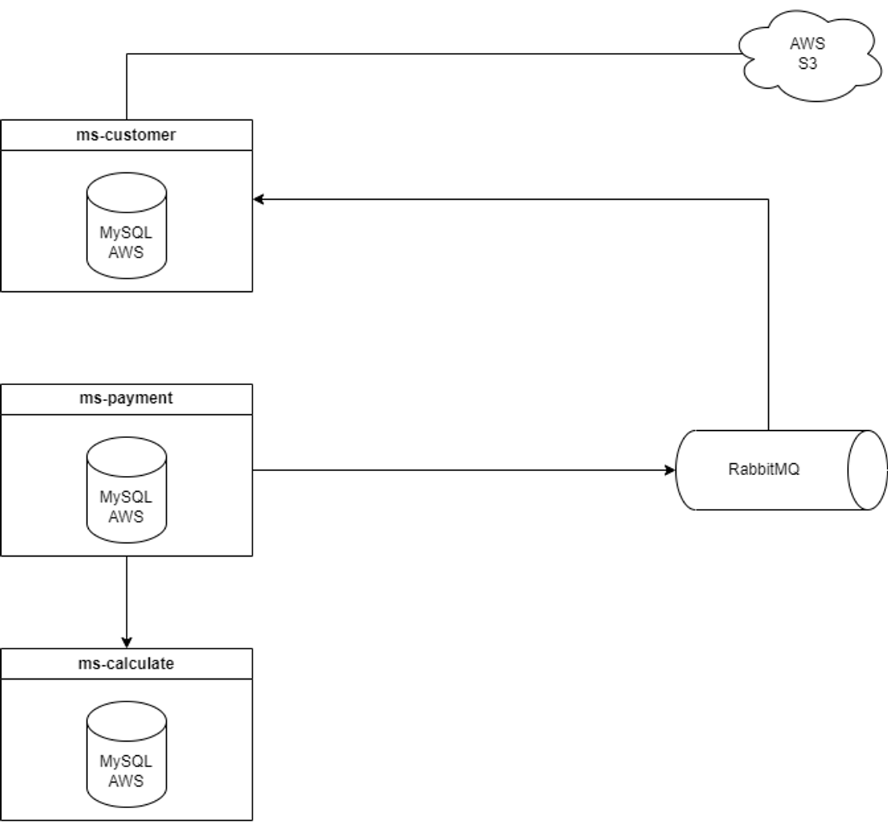
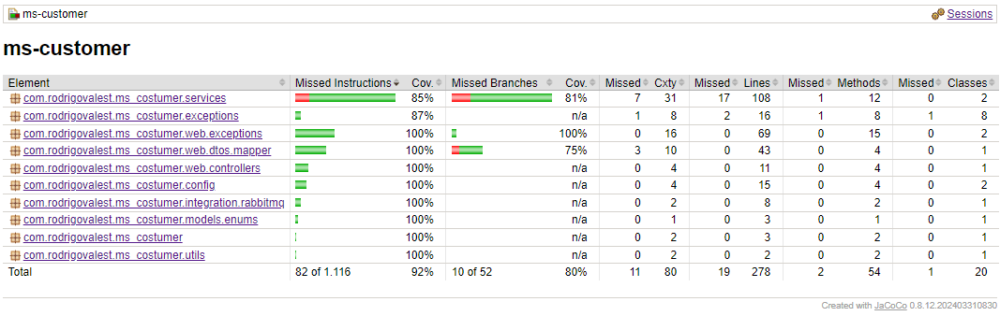
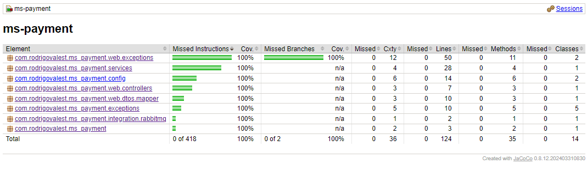
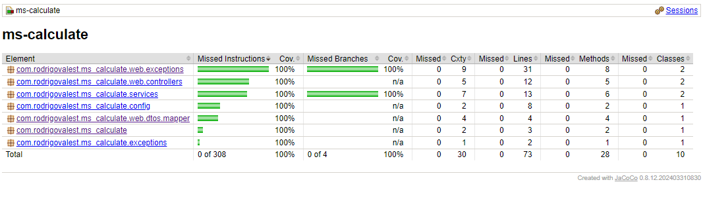

# PbAbrilDes3_RodrigoDoValeStankowicz

## Summary

- [Intro](#intro)
- [cURL](#curl)
- [JaCoCo](#jacoco)

## Intro

The American Bank is planning to create a digital product. This product is a rewards program where customers earn points corresponding to the total amount spent on the bank's credit cards with each purchase.



## Run
- 

## cURL

To see more informations, access the swagger docs in `/swagger-ui/index.html`

### ms-customer

Create customer
```
curl --request POST \
  --url http://localhost:18001/v1/customers \
  --header 'Content-Type: application/json' \
  --data '{
	"cpf": "484.205.720-39",
	"name": "cassio",
	"gender": "Masculino",
	"birthdate": "26/10/2005",
	"email": "cassio@email.com",
	"photo": "/9j/4AAQSkZJRgABAQAAAQABAAD/2wCEAAYGBgYHBgcICAcKCwoLCg8ODAwODxYQERAREBYiFRkVFRkVIh4kHhweJB42KiYmKjY+NDI0PkxERExfWl98fKcBBgYGBgcGBwgIBwoLCgsKDw4MDA4PFhAREBEQFiIVGRUVGRUiHiQeHB4kHjYqJiYqNj40MjQ+TERETF9aX3x8p//CABEIAAoACgMBIgACEQEDEQH/xAAnAAEBAAAAAAAAAAAAAAAAAAAABgEBAAAAAAAAAAAAAAAAAAAAAP/aAAwDAQACEAMQAAAClAf/xAAC/9oADAMBAAIAAwAAACED/8QAAv/aAAwDAQACAAMAAAAQ8//EABQRAQAAAAAAAAAAAAAAAAAAAAD/2gAIAQIBAT8Af//EABQRAQAAAAAAAAAAAAAAAAAAAAD/2gAIAQMBAT8Af//EABQQAQAAAAAAAAAAAAAAAAAAACD/2gAIAQEAAT8CH//EABQQAQAAAAAAAAAAAAAAAAAAACD/2gAIAQEAAT8hH//EABQQAQAAAAAAAAAAAAAAAAAAACD/2gAIAQEAAT8QH//Z"
}'
```

Get customer by ID
```
curl --request GET \
  --url http://localhost:18001/v1/customers/1
```

Update customer
```
curl --request PUT \
  --url http://localhost:18001/v1/customers/2 \
  --header 'Content-Type: application/json' \
  --data '{
	"cpf": "484.205.720-39",
	"name": "cassio updated",
	"gender": "Masculino",
	"birthdate": "26/10/2000",
	"email": "cassio@email.com",
	"photo": "/9j/4AAQSkZJRgABAQAAAQABAAD/2wCEAAYGBgYHBgcICAcKCwoLCg8ODAwODxYQERAREBYiFRkVFRkVIh4kHhweJB42KiYmKjY+NDI0PkxERExfWl98fKcBBgYGBgcGBwgIBwoLCgsKDw4MDA4PFhAREBEQFiIVGRUVGRUiHiQeHB4kHjYqJiYqNj40MjQ+TERETF9aX3x8p//CABEIAAoACgMBIgACEQEDEQH/xAAnAAEBAAAAAAAAAAAAAAAAAAAABgEBAAAAAAAAAAAAAAAAAAAAAP/aAAwDAQACEAMQAAAClAf/xAAC/9oADAMBAAIAAwAAACED/8QAAv/aAAwDAQACAAMAAAAQ8//EABQRAQAAAAAAAAAAAAAAAAAAAAD/2gAIAQIBAT8Af//EABQRAQAAAAAAAAAAAAAAAAAAAAD/2gAIAQMBAT8Af//EABQQAQAAAAAAAAAAAAAAAAAAACD/2gAIAQEAAT8CH//EABQQAQAAAAAAAAAAAAAAAAAAACD/2gAIAQEAAT8hH//EABQQAQAAAAAAAAAAAAAAAAAAACD/2gAIAQEAAT8QH//Z"
}'
```

Delete customer by ID
```
curl --request DELETE \
  --url http://localhost:18001/v1/customers/2
```

### ms-payment

Create payment
```
curl --request POST \
  --url http://localhost:18002/v1/payments \
  --header 'Content-Type: application/json' \
  --header 'User-Agent: insomnia/2023.5.8' \
  --data '{
  "customerId": 2,
  "categoryId": 1,
  "total": 1000
}'
```

Get payment by ID
```
curl --request GET \
  --url http://localhost:18002/v1/payments/c0e1957f-1a50-407e-a026-5c517670feaa
```

Get payments by user ID
```
curl --request GET \
  --url http://localhost:18002/v1/payments/user/2
```

### ms-calculate

Calculate
```
curl --request POST \
  --url http://localhost:18000/v1/calculate \
  --header 'Content-Type: application/json' \
  --data '{
	"value": 1000,
	"categoryId": 1
}'
```

Create rule
```
curl --request POST \
  --url http://localhost:18000/v1/rules \
  --header 'Content-Type: application/json' \
  --data '{
	"category": "category name x",
	"parity": 2
}'
```

Get rule by ID
```
curl --request GET \
  --url http://localhost:18000/v1/rules/1
```

Update rule
```
curl --request PUT \
  --url http://localhost:18000/v1/rules/1
```

Delete rule by ID
```
curl --request DELETE \
  --url http://localhost:18000/v1/rules/1
```

## JaCoCo

### ms-customer



### ms-payment



### ms-calculate



---

Rodrigo do Vale Stankowicz
